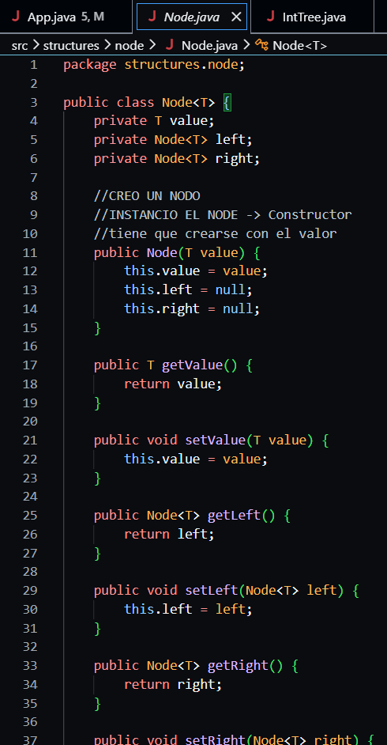
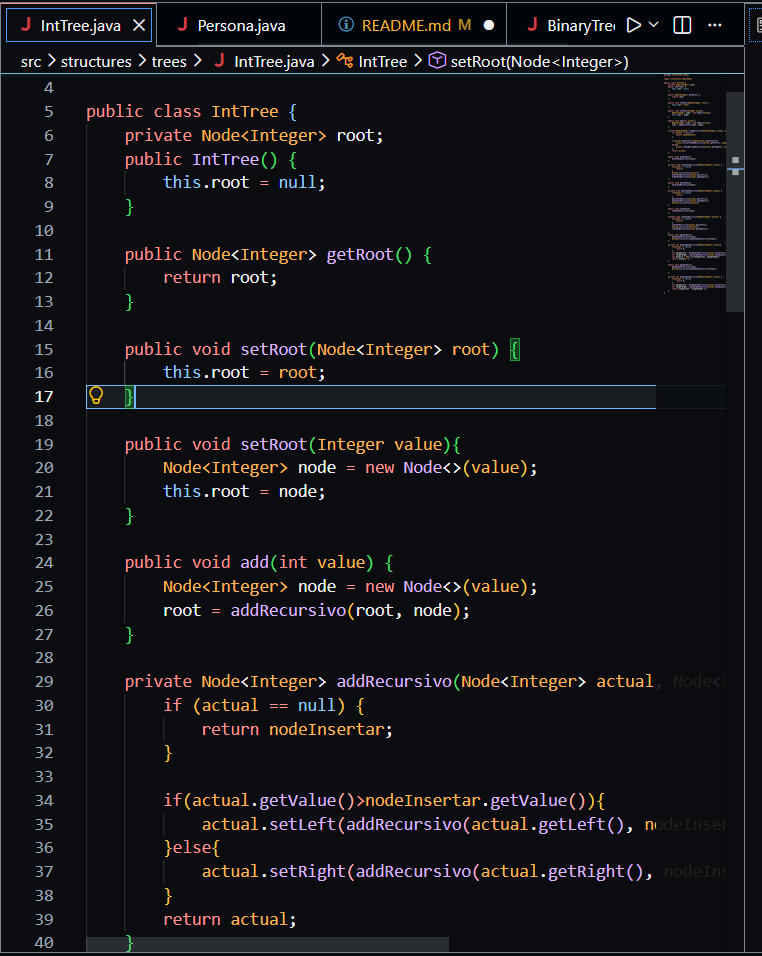

# Universidad Politecnica Salesiana

## Proyecto: Estructuras No Lineales
## Estudiante: Axel Gonzalez

## PC: 2.3 - Estructuras No Lineales (PRIMERA CLASE)
### Fecha: 2026-06-17
### Descripcion:

Cree la clase Node que sirve como nodo para el arbol binario tiene el valor y los hijos izquierdo y derecho con sus getters y setters y un constructor que recibe el valor con el que se crea el nodo. Ademas, la clase IntTree que es un arbol binario de busqueda para numeros enteros usando la clase Node tiene el metodo add para ir agregando los numeros porque solo fue un primer avance
### Codigo: 

## PC: 2.3 - Estructuras No Lineales (SEGUNDA CLASE)
### Fecha: 2026-06-19
### Descripcion:
En esta clase terminamos de hacer lo de los recorridos en orden preorden inorden y posorden tambien tiene metodos para sacar la altura y el peso del arbol. Luego cree la clase Persona con nombre y edad y la hice comparable para que se pueda ordenar primero por edad y si tienen la misma edad por nombre tambien cree la clase BinaryTree que es parecida a IntTree pero sirve para cualquier tipo de dato que se pueda comparar incluyendo los objetos Persona y tiene los mismos metodos de recorrido y de altura y pesona
### Codigo: 
### Salida en consola: 

