# Universidad Politecnica Salesiana

## Proyecto: Estructuras No Lineales
## Estudiante: Axel Gonzalez

## PL2.2 Ejercicos Arboles
### Fecha: 2026-06-24

## Ejercicio 1: Insertar un arbol binario de busqueda
### Descripcion:
Lo que hace este metodo es recibir un arreglo de numeros enteros y con eso armar un arbol binario de busqueda. Basicamente lo que pasa es que por cada numero del arreglo se llama al metodo add del IntTree que ya se encarga de ponerlo en el lugar correcto segun si es mayor o menor que el nodo actual. Despues de insertar todos los numeros se imprime el arbol de forma horizontal usando un metodo recursivo que primero va a la derecha, imprime el nodo con sus espacios segun el nivel, y despues va a la izquierda, lo que hace que visualmente se vea como un arbol de lado.

### Codigo: 
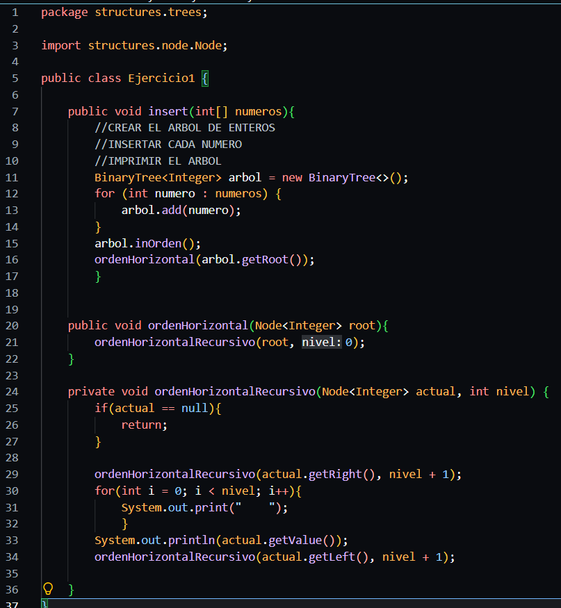

### Observacion: 
Los numeros se van insertando correctamente siguiendo las reglas del BST donde los menores van a la izquierda y los mayores a la derecha, y al final el arbol se puede ver de forma visual en la consola.

### Salida en consola: 
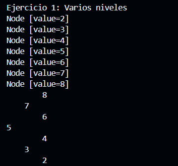

### Resultados:
Al probarlo con arbol vacio no imprime nada porque no hay nodos, con un solo nodo solo muestra ese valor, con varios niveles se ve el arbol completo de lado donde los mayores quedan arriba y los menores abajo y con el lineal los nodos van en diagonal porque cada uno solo tiene hijo derecho

## Ejercicio 2: Invertir un arbol binario
### Descripcion:
Este metodo lo que hace es invertir el arbol, o sea que el hijo izquierdo pasa a ser el derecho y viceversa en cada nodo. Lo importante aca es guardar el hijo izquierdo en una variable temporal antes de hacer cualquier cambio, porque si no se hace eso se pierde la referencia y el arbol queda mal. Despues se llama recursivamente para que haga lo mismo con todos los nodos del arbol hasta llegar a los que no tienen hijos donde simplemente retorna null.

### Codigo: 
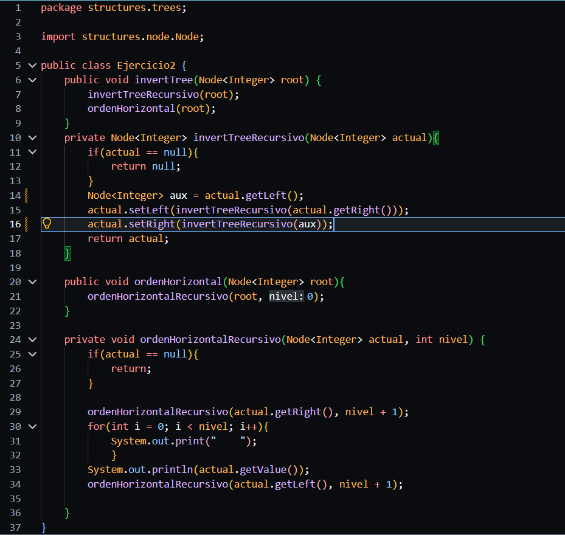

### Observacion: 
La clave de este ejercicio es el uso de la variable temporal para no perder el hijo izquierdo antes de reemplazarlo, sin eso el algoritmo no funciona bien porque estaria usando un valor que ya cambio.

### Salida en consola: 
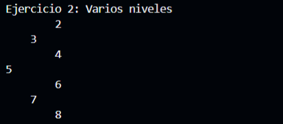

### Resultados:
Con arbol vacio no pasa nada, con un solo nodo se imprime igual porque no tiene hijos que intercambiar, con varios niveles el arbol queda invertido correctamente donde lo que estaba a la derecha ahora esta a la izquierda y con el lineal que iba hacia la derecha despues de invertirlo va hacia la izquierda

## Ejercicio 3: Listar niveles en listas enlazadas
### Descripcion:
Lo que hace este metodo es recorrer el arbol de forma recursiva pasandole el nodo actual, el nivel en el que esta y la lista general de niveles. Cada vez que llega a un nodo revisa si ya existe una lista para ese nivel, si no existe la crea y la agrega. Despues agrega el nodo actual a la lista que corresponde a su nivel y se llama recursivamente primero con el hijo izquierdo y luego con el derecho aumentando el nivel en 1 cada vez hasta que llega a un nodo null donde para.

### Codigo: 
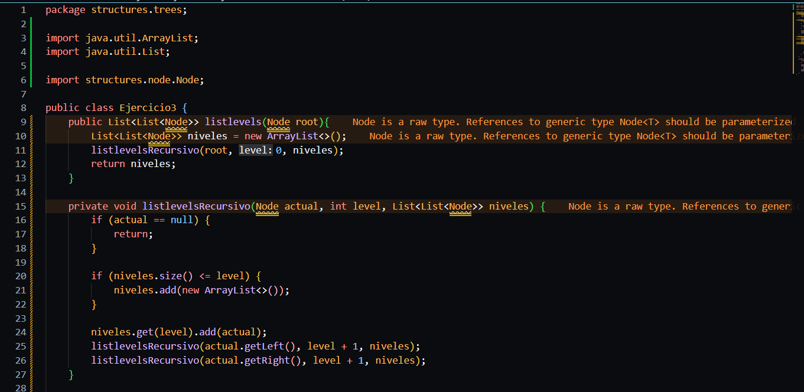
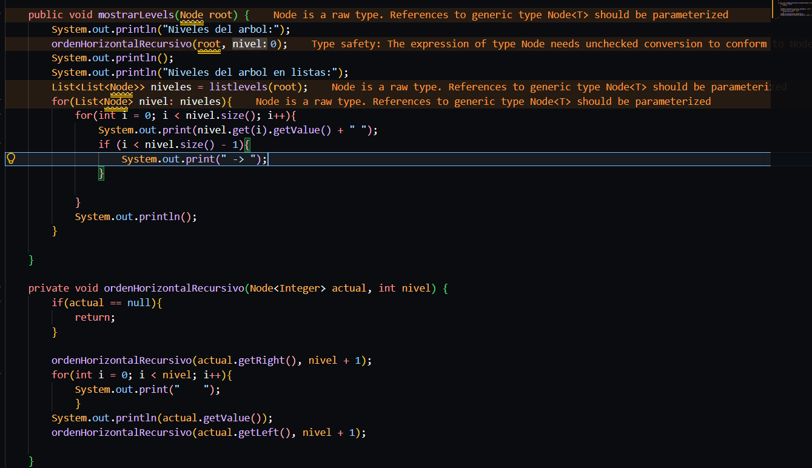

### Observacion: 
Este metodo usa recursion para agrupar los nodos por nivel, la clave es que el nivel se va pasando como parametro en cada llamada recursiva entonces cada nodo sabe exactamente en que lista tiene que agregarse sin necesidad de recorrer el arbol de otra forma

### Salida en consola: 
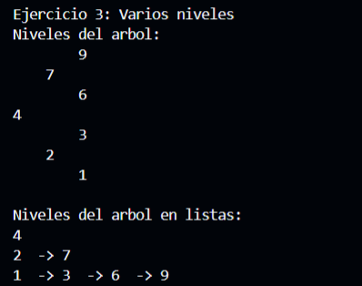

### Resultados:
Con arbol vacio no aparece ninguna lista, con un solo nodo sale una lista con ese valor, con varios niveles salen 3 listas donde cada una tiene los nodos de ese nivel separados por flechas y con el lineal sale una lista por cada nodo porque en cada nivel solo hay uno

## Ejercicio 4: Calcular la profundidad maxima 
### Descripcion:
Este metodo calcula cuantos niveles tiene el arbol contando desde la raiz hasta el nodo mas profundo. Lo hace de forma recursiva bajando por cada lado del arbol, cuando llega a un nodo que no existe retorna 0, y cuando esta en un nodo real retorna 1 mas el maximo entre la profundidad del lado izquierdo y el lado derecho. Asi va sumando de abajo hacia arriba hasta llegar a la raiz donde ya tiene el total.

### Codigo: 
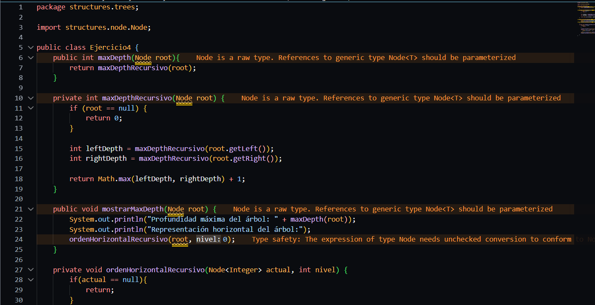
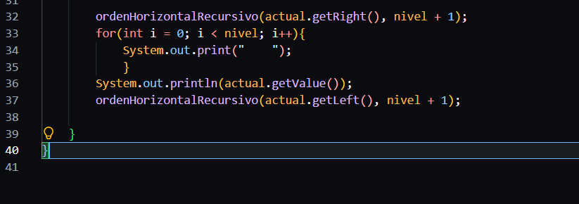

### Observacion: 
La recursividad aqui es bastante clara porque el caso base es cuando el nodo es null y el caso recursivo simplemente compara los dos lados y se queda con el mas largo sumandole 1 por el nodo actual.

### Salida en consola: 
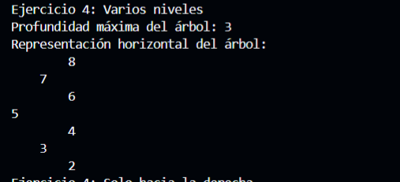

### Resultados:
Con arbol vacio da 0, con un solo nodo da 1, con varios niveles da 3 que es el camino mas largo desde la raiz hasta abajo y con el lineal de 4 nodos da 4 porque cada nodo ocupa un nivel distinto

##  Todos los casos de prueba
## Ejercicio 1:
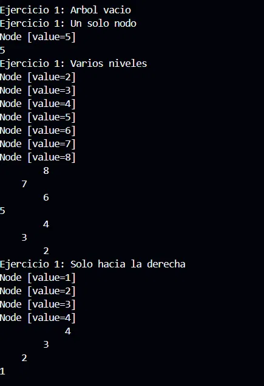
## Ejercicio 2:
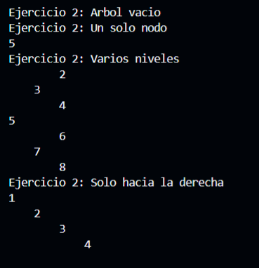
## Ejercicio 3:
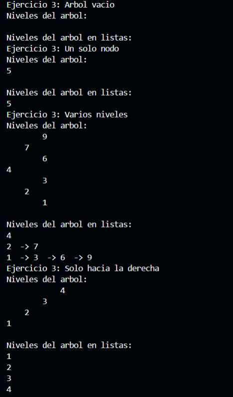
## Ejercicio 4:
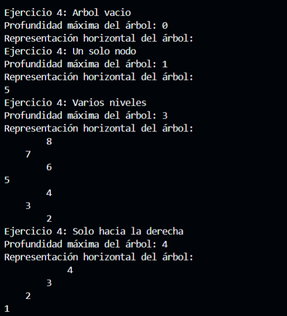
